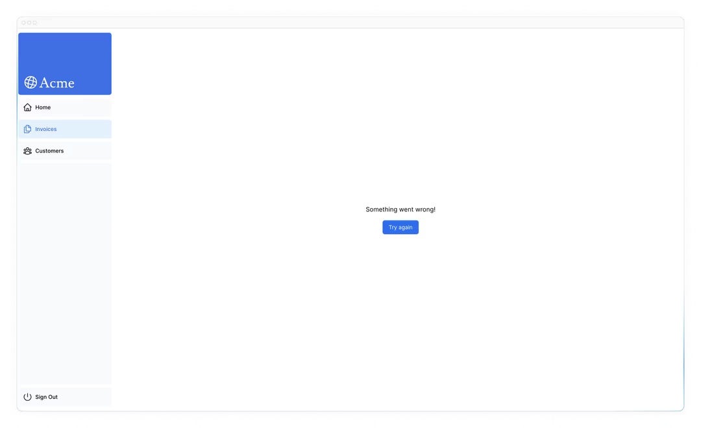
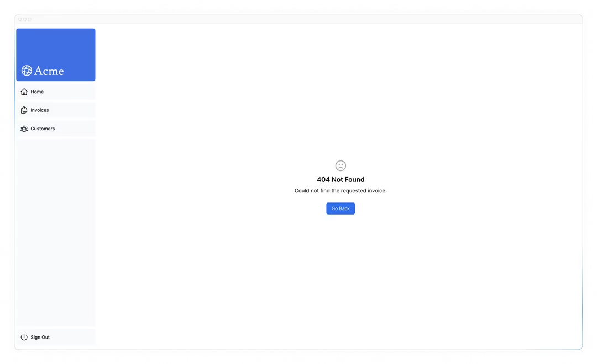

# Bab 13

## Handling Errors
Pada bab sebelumnya, Anda belajar cara memutasi data menggunakan Server Actions. Sekarang, mari kita lihat bagaimana cara menangani kesalahan dengan baik menggunakan pernyataan try/catch JavaScript dan API Next.js.

### Dalam bab ini...
Berikut adalah topik yang akan kita bahas
- Cara menggunakan file error.tsx khusus untuk menangkap kesalahan di segmen rute Anda, dan menampilkan UI pengganti kepada pengguna.
- Cara menggunakan fungsi notFound dan file not-found untuk menangani kesalahan 404 (untuk sumber daya yang tidak ada).

### Menambahkan try/catch ke Server Actions
Pertama, mari kita tambahkan pernyataan try/catch JavaScript ke Server Actions Anda untuk memungkinkan Anda menangani kesalahan dengan baik.

Jika Anda sudah tahu caranya, habiskan beberapa menit untuk memperbarui Server Actions Anda, atau Anda dapat menyalin kode di bawah ini:

Catatan bagaimana redirect dipanggil di luar blok try/catch. Ini karena redirect bekerja dengan melemparkan kesalahan, yang akan ditangkap oleh blok catch. Untuk menghindari ini, Anda dapat memanggil redirect setelah try/catch. redirect hanya akan dapat dijangkau jika try berhasil.

Sekarang, mari kita periksa apa yang terjadi ketika kesalahan dilemparkan dalam Server Action Anda. Anda dapat melakukannya dengan melempar kesalahan lebih awal. Misalnya, dalam action deleteInvoice, lemparkan kesalahan di bagian atas fungsi:

```javascript
// /app/lib/actions.ts
export async function deleteInvoice(id: string) {
  throw new Error('Failed to Delete Invoice');
 
  // Blok kode yang tidak dapat dijangkau
  try {
    await sql`DELETE FROM invoices WHERE id = ${id}`;
    revalidatePath('/dashboard/invoices');
    return { message: 'Deleted Invoice' };
  } catch (error) {
    return { message: 'Database Error: Failed to Delete Invoice' };
  }
}
```

Ketika Anda mencoba menghapus faktur, Anda harus melihat kesalahan di localhost. Pastikan untuk menghapus kesalahan ini setelah pengujian dan sebelum melanjutkan ke bagian berikutnya.

Melihat kesalahan ini membantu saat mengembangkan karena Anda dapat menangkap masalah potensial lebih awal. Namun, Anda juga ingin menampilkan kesalahan kepada pengguna untuk menghindari kegagalan yang tiba-tiba dan memungkinkan aplikasi Anda terus berjalan.

Di sinilah file error.tsx Next.js masuk.

### Menangani semua kesalahan dengan error.tsx
File error.tsx dapat digunakan untuk mendefinisikan batas UI untuk segmen rute. Ini berfungsi sebagai penangkap semua kesalahan yang tidak terduga dan memungkinkan Anda menampilkan UI pengganti kepada pengguna Anda.

Di dalam folder /dashboard/invoices Anda, buat file baru bernama error.tsx dan tempelkan kode berikut:

```javascript
// /dashboard/invoices/error.tsx
'use client';
 
import { useEffect } from 'react';
 
export default function Error({
  error,
  reset,
}: {
  error: Error & { digest?: string };
  reset: () => void;
}) {
  useEffect(() => {
    // Opsional log kesalahan ke layanan pelaporan kesalahan
    console.error(error);
  }, [error]);
 
  return (
    <main className="flex h-full flex-col items-center justify-center">
      <h2 className="text-center">Something went wrong!</h2>
      <button
        className="mt-4 rounded-md bg-blue-500 px-4 py-2 text-sm text-white transition-colors hover:bg-blue-400"
        onClick={
          // Coba pulihkan dengan mencoba merender ulang rute faktur
          () => reset()
        }
      >
        Try again
      </button>
    </main>
  );
}
```

Ada beberapa hal yang akan Anda perhatikan tentang kode di atas:
- `"use client"` - error.tsx harus menjadi Komponen Klien.
- Menerima dua prop:
  - `error`: Objek ini adalah instance dari objek Error asli JavaScript.
  - `reset`: Fungsi ini untuk mereset batas kesalahan. Saat dijalankan, fungsi ini akan mencoba merender ulang segmen rute.

Ketika Anda mencoba menghapus faktur lagi, Anda harus melihat UI berikut:


### Menangani kesalahan 404 dengan fungsi notFound
Cara lain untuk menangani kesalahan dengan baik adalah dengan menggunakan fungsi notFound. Sementara error.tsx berguna untuk menangkap semua kesalahan, notFound dapat digunakan ketika Anda mencoba mengambil sumber daya yang tidak ada.

Misalnya, kunjungi http://localhost:3000/dashboard/invoices/2e94d1ed-d220-449f-9f11-f0bbceed9645/edit.

Ini adalah UUID palsu yang tidak ada di database Anda.

Anda akan segera melihat error.tsx muncul karena ini adalah rute anak dari /invoices di mana error.tsx didefinisikan.

Namun, jika Anda ingin lebih spesifik, Anda dapat menampilkan kesalahan 404 untuk memberi tahu pengguna bahwa sumber daya yang mereka coba akses tidak ditemukan.

Anda dapat memastikan bahwa sumber daya tidak ditemukan dengan masuk ke fungsi fetchInvoiceById di data.ts Anda, dan mencetak faktur yang dikembalikan:

```javascript
// /app/lib/data.ts
export async function fetchInvoiceById(id: string) {
  noStore();
  try {
    // ...
 
    console.log(invoice); // Faktur adalah array kosong []
    return invoice[0];
  } catch (error) {
    console.error('Database Error:', error);
    throw new Error('Failed to fetch invoice.');
  }
}
```

Sekarang setelah Anda tahu bahwa faktur tidak ada di database Anda, mari kita gunakan notFound untuk menanganinya. Arahkan ke /dashboard/invoices/[id]/edit/page.tsx, dan impor { notFound } dari 'next/navigation'.

Kemudian, Anda dapat menggunakan conditional untuk memanggil notFound jika faktur tidak ada:

```javascript
// /dashboard/invoices/[id]/edit/page.tsx
import { fetchInvoiceById, fetchCustomers } from '@/app/lib/data';
import { updateInvoice } from '@/app/lib/actions';
import { notFound } from 'next/navigation';
 
export default async function Page({ params }: { params: { id: string } }) {
  const id = params.id;
  const [invoice, customers] = await Promise.all([
    fetchInvoiceById(id),
    fetchCustomers(),
  ]);
 
  if (!invoice) {
    notFound();
  }
 
  // ...
}
```

Sempurna! <Page> sekarang akan melempar kesalahan jika faktur tertentu tidak ditemukan. Untuk menampilkan UI kesalahan kepada pengguna, buat file not-found.tsx di dalam folder /edit.


Kemudian, di dalam file not-found.tsx, tempelkan kode berikut:

```javascript
// /dashboard/invoices/[id]/edit/not-found.tsx
import Link from 'next/link';
import { FaceFrownIcon } from '@heroicons/react/24/outline';
 
export default function NotFound() {
  return (
    <main className="flex h-full flex-col items-center justify-center gap-2">
      <FaceFrownIcon className="w-10 text-gray-400" />
      <h2 className="text-xl font-semibold">404 Not Found</h2>
      <p>Could not find the requested invoice.</p>
      <Link
        href="/dashboard/invoices"
        className="mt-4 rounded-md bg-blue-500 px-4 py-2 text-sm text-white transition-colors hover:bg-blue-400"
      >
        Go Back
      </Link>
    </main>
  );
}
```

Segarkan rute, dan Anda sekarang harus melihat UI berikut:


Hal ini perlu diingat, notFound akan mengambil alih error.tsx, jadi Anda dapat mencapainya saat Anda ingin menangani kesalahan yang lebih spesifik!

### Bacaan lebih lanjut
Untuk mempelajari lebih lanjut tentang penanganan kesalahan di Next.js, lihat dokumentasi berikut:
- [Error Handling](https://nextjs.org/docs/advanced-features/error-handling)
- [error.js API Reference](https://nextjs.org/docs/api-reference/error)
- [notFound() API Reference](https://nextjs.org/docs/api-reference/notfound)
- [not-found.js API Reference](https://nextjs.org/docs/api-reference/notfound)
