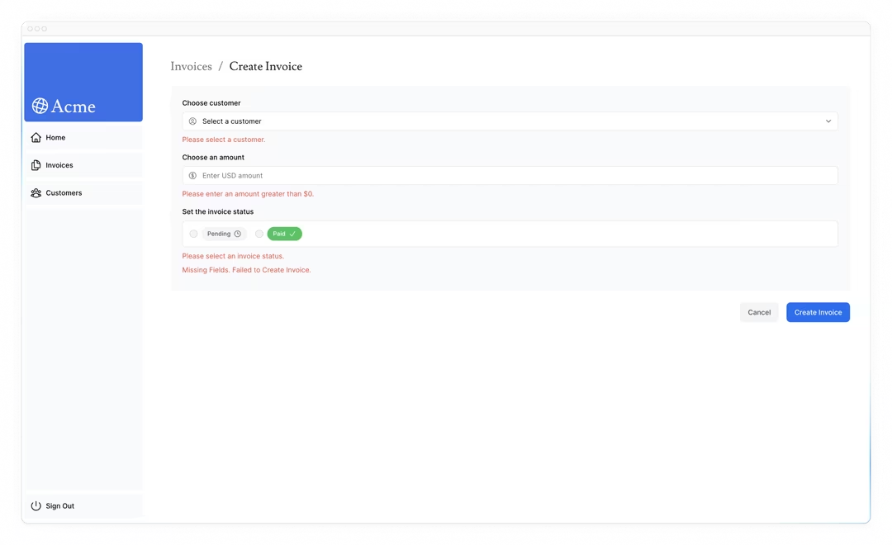

# Bab 14

## Improving Accessibility
Pada bab sebelumnya, kita telah membahas bagaimana menangani kesalahan (termasuk kesalahan 404) dan menampilkan fallback kepada pengguna. Namun, kita masih perlu mendiskusikan satu bagian penting lagi: validasi formulir. Mari kita lihat cara mengimplementasikan validasi sisi server dengan Server Actions, dan cara menampilkan kesalahan formulir menggunakan hook `useActionState` React - sambil tetap memperhatikan aksesibilitas!

### Dalam bab ini...
Berikut adalah topik yang akan kita bahas:
- Cara menggunakan eslint-plugin-jsx-a11y dengan Next.js untuk mengimplementasikan praktik terbaik aksesibilitas.
- Cara mengimplementasikan validasi formulir sisi server.
- Cara menggunakan hook React `useActionState` untuk menangani kesalahan formulir, dan menampilkannya kepada pengguna.

### Apa itu aksesibilitas?
Aksesibilitas mengacu pada merancang dan mengimplementasikan aplikasi web yang dapat digunakan oleh semua orang, termasuk mereka yang memiliki disabilitas. Ini adalah topik yang luas yang mencakup banyak area, seperti navigasi keyboard, HTML semantik, gambar, warna, video, dll.

Meskipun kita tidak akan membahas secara mendalam tentang aksesibilitas dalam kursus ini, kita akan mendiskusikan fitur aksesibilitas yang tersedia di Next.js dan beberapa praktik umum untuk membuat aplikasi Anda lebih mudah diakses.

Jika Anda ingin mempelajari lebih lanjut tentang aksesibilitas, kami merekomendasikan kursus Learn Accessibility oleh web.dev.

### Menggunakan plugin aksesibilitas ESLint di Next.js
Next.js menyertakan plugin `eslint-plugin-jsx-a11y` dalam konfigurasi ESLint-nya untuk membantu menangkap masalah aksesibilitas sejak dini. Misalnya, plugin ini akan memberikan peringatan jika Anda memiliki gambar tanpa teks alt, menggunakan atribut aria-* dan role secara tidak benar, dan banyak lagi.

Opsional, jika Anda ingin mencoba ini, tambahkan `next lint` sebagai skrip dalam file package.json Anda:

```json
"scripts": {
    "build": "next build",
    "dev": "next dev",
    "start": "next start",
    "lint": "next lint"
},
```

Kemudian jalankan `pnpm lint` di terminal Anda:

```bash
pnpm lint
```

Ini akan memandu Anda melalui instalasi dan konfigurasi ESLint untuk proyek Anda. Jika Anda menjalankan `pnpm lint` sekarang, Anda harus melihat output berikut:

```bash
✔ No ESLint warnings or errors
```

Namun, apa yang akan terjadi jika Anda memiliki gambar tanpa teks alt? Mari kita cari tahu!

Pergi ke `/app/ui/invoices/table.tsx` dan hapus prop alt dari gambar. Anda dapat menggunakan fitur pencarian editor Anda untuk dengan cepat menemukan `<Image>`:

```javascript
// /app/ui/invoices/table.tsx
<Image
  src={invoice.image_url}
  className="rounded-full"
  width={28}
  height={28}
  alt={`${invoice.name}'s profile picture`} // Hapus baris ini
/>
```

Sekarang jalankan `pnpm lint` lagi, dan Anda harus melihat peringatan berikut:

```bash
./app/ui/invoices/table.tsx
45:25  Warning: Image elements must have an alt prop,
either with meaningful text, or an empty string for decorative images. jsx-a11y/alt-text
```

Meskipun menambahkan dan mengkonfigurasi linter bukan langkah yang diwajibkan, ini bisa membantu menangkap masalah aksesibilitas dalam proses pengembangan Anda.

### Meningkatkan aksesibilitas formulir
Ada tiga hal yang sudah kita lakukan untuk meningkatkan aksesibilitas dalam formulir kita:
- **HTML Semantik**: Menggunakan elemen semantik (`<input>`, `<option>`, dll) daripada `<div>`. Ini memungkinkan teknologi bantu (AT) untuk fokus pada elemen input dan memberikan informasi kontekstual yang sesuai kepada pengguna, membuat formulir lebih mudah dinavigasi dan dipahami.
- **Pelabelan**: Menyertakan `<label>` dan atribut htmlFor memastikan bahwa setiap bidang formulir memiliki teks label deskriptif. Ini meningkatkan dukungan AT dengan memberikan konteks dan juga meningkatkan kegunaan dengan memungkinkan pengguna untuk mengklik label untuk fokus pada bidang input yang sesuai.
- **Outline Fokus**: Bidang-bidang diformat dengan baik untuk menunjukkan outline ketika mereka dalam fokus. Ini penting untuk aksesibilitas karena ini secara visual menunjukkan elemen aktif di halaman, membantu pengguna keyboard dan pembaca layar untuk memahami di mana mereka berada di formulir. Anda dapat memverifikasi ini dengan menekan tab.

Praktik-praktik ini meletakkan dasar yang baik untuk membuat formulir Anda lebih mudah diakses bagi banyak pengguna. Namun, mereka tidak menangani validasi formulir dan kesalahan.

### Validasi Formulir
Pergi ke http://localhost:3000/dashboard/invoices/create, dan kirimkan formulir kosong. Apa yang terjadi?

Anda mendapatkan kesalahan! Ini karena Anda mengirimkan nilai formulir kosong ke Server Action Anda. Anda dapat mencegah ini dengan memvalidasi formulir Anda di klien atau server.

#### Validasi Sisi Klien
Ada beberapa cara Anda dapat memvalidasi formulir di klien. Cara paling sederhana adalah mengandalkan validasi formulir yang disediakan oleh browser dengan menambahkan atribut required ke elemen `<input>` dan `<select>` dalam formulir Anda. Misalnya:

```javascript
// /app/ui/invoices/create-form.tsx
<input
  id="amount"
  name="amount"
  type="number"
  placeholder="Enter USD amount"
  className="peer block w-full rounded-md border border-gray-200 py-2 pl-10 text-sm outline-2 placeholder:text-gray-500"
  required
/>
```

Kirimkan formulir lagi. Browser akan menampilkan peringatan jika Anda mencoba mengirimkan formulir dengan nilai kosong.

Pendekatan ini umumnya oke karena beberapa AT mendukung validasi browser.

Alternatif untuk validasi sisi klien adalah validasi sisi server. Mari kita lihat bagaimana Anda dapat mengimplementasikannya di bagian berikut. Untuk saat ini, hapus atribut required jika Anda menambahkannya.

#### Validasi Sisi Server
Dengan memvalidasi formulir di server, Anda dapat:
- Memastikan data Anda dalam format yang diharapkan sebelum mengirimkannya ke database Anda.
- Mengurangi risiko pengguna jahat melewati validasi sisi klien.
- Memiliki satu sumber kebenaran untuk apa yang dianggap data valid.

Di komponen `create-form.tsx` Anda, impor hook `useActionState` dari react. Karena `useActionState` adalah hook, Anda perlu mengubah formulir Anda menjadi Komponen Klien menggunakan direktif `"use client"`:

```javascript
// /app/ui/invoices/create-form.tsx
'use client';
 
// ...
import { useActionState } from 'react';
```

Di dalam Komponen Form Anda, hook `useActionState`:
- Menerima dua argumen: `(action, initialState)`.
- Mengembalikan dua nilai: `[state, formAction]` - status formulir, dan fungsi yang dipanggil saat formulir dikirimkan.

Luluskan action `createInvoice` Anda sebagai argumen `useActionState`, dan di dalam atribut `<form action={}>`, panggil `formAction`.

```javascript
// /app/ui/invoices/create-form.tsx
// ...
import { useActionState } from 'react';
 
export default function Form({ customers }: { customers: CustomerField[] }) {
  const [state, formAction] = useActionState(createInvoice, initialState);
 
  return <form action={formAction}>...</form>;
}
```

`initialState` bisa berupa apa saja yang Anda definisikan, dalam hal ini, buat objek dengan dua kunci kosong: message dan errors, dan impor tipe State dari file `actions.ts` Anda:

```javascript
// /app/ui/invoices/create-form.tsx
// ...
import { createInvoice, State } from '@/app/lib/actions';
import { useActionState } from 'react';
 
export default function Form({ customers }: { customers: CustomerField[] }) {
  const initialState: State = { message: null, errors: {} };
  const [state, formAction] = useActionState(createInvoice, initialState);
 
  return <form action={formAction}>...</form>;
}
```

Ini mungkin tampak membingungkan pada awalnya, tetapi akan lebih masuk akal setelah Anda memperbarui action server. Mari kita lakukan sekarang.

Di file `actions.ts` Anda, Anda dapat menggunakan Zod untuk memvalidasi data formulir. Perbarui `FormSchema` Anda sebagai berikut:

```javascript
// /app/lib/actions.ts
const FormSchema = z.object({
  id: z.string(),
  customerId: z.string({
    invalid_type_error: 'Please select a customer.',
  }),
  amount: z.coerce
    .number()
    .gt(0, { message: 'Please enter an amount greater than $0.' }),
  status: z.enum(['pending', 'paid'], {
    invalid_type_error: 'Please select an invoice status.',
  }),
  date: z.string(),
});
```

- `customerId` - Zod sudah melempar kesalahan jika bidang pelanggan kosong karena mengharapkan tipe string. Tapi mari tambahkan pesan yang ramah jika pengguna tidak memilih pelanggan.
- `amount` - Karena Anda mengonversi tipe jumlah dari string ke number, itu akan default ke nol jika string kosong. Mari beri tahu Zod bahwa kita selalu ingin jumlah lebih besar dari 0 dengan fungsi `.gt()`.
- `status` - Zod sudah melempar kesalahan jika bidang status kosong karena

 mengharapkan "pending" atau "paid". Mari juga tambahkan pesan yang ramah jika pengguna tidak memilih status.

Selanjutnya, perbarui action `createInvoice` Anda untuk menerima dua parameter - `prevState` dan `formData`:

```javascript
// /app/lib/actions.ts
export type State = {
  errors?: {
    customerId?: string[];
    amount?: string[];
    status?: string[];
  };
  message?: string | null;
};
 
export async function createInvoice(prevState: State, formData: FormData) {
  // ...
}
```

- `formData` - sama seperti sebelumnya.
- `prevState` - berisi status yang diteruskan dari hook `useActionState`. Anda tidak akan menggunakannya dalam action dalam contoh ini, tetapi ini adalah prop yang diperlukan.

Kemudian, ubah fungsi parse() Zod menjadi safeParse():

```javascript
// /app/lib/actions.ts
export async function createInvoice(prevState: State, formData: FormData) {
  // Validasi bidang formulir menggunakan Zod
  const validatedFields = CreateInvoice.safeParse({
    customerId: formData.get('customerId'),
    amount: formData.get('amount'),
    status: formData.get('status'),
  });
 
  // ...
}
```

safeParse() akan mengembalikan objek yang berisi field success atau error. Ini akan membantu menangani validasi lebih baik tanpa harus menempatkan logika ini di dalam blok try/catch.

Sebelum mengirimkan informasi ke database Anda, periksa apakah bidang formulir divalidasi dengan benar dengan conditional:

```javascript
// /app/lib/actions.ts
export async function createInvoice(prevState: State, formData: FormData) {
  // Validasi bidang formulir menggunakan Zod
  const validatedFields = CreateInvoice.safeParse({
    customerId: formData.get('customerId'),
    amount: formData.get('amount'),
    status: formData.get('status'),
  });
 
  // Jika validasi formulir gagal, kembalikan kesalahan lebih awal. Jika tidak, lanjutkan.
  if (!validatedFields.success) {
    return {
      errors: validatedFields.error.flatten().fieldErrors,
      message: 'Missing Fields. Failed to Create Invoice.',
    };
  }
 
  // ...
}
```

Jika `validatedFields` tidak berhasil, kita mengembalikan fungsi lebih awal dengan pesan kesalahan dari Zod.

Tip: console.log `validatedFields` dan kirimkan formulir kosong untuk melihat bentuknya.

Akhirnya, karena Anda menangani validasi formulir secara terpisah, di luar blok try/catch Anda, Anda dapat mengembalikan pesan khusus untuk kesalahan database apa pun, kode akhir Anda harus terlihat seperti ini:

```javascript
// /app/lib/actions.ts
export async function createInvoice(prevState: State, formData: FormData) {
  // Validasi formulir menggunakan Zod
  const validatedFields = CreateInvoice.safeParse({
    customerId: formData.get('customerId'),
    amount: formData.get('amount'),
    status: formData.get('status'),
  });
 
  // Jika validasi formulir gagal, kembalikan kesalahan lebih awal. Jika tidak, lanjutkan.
  if (!validatedFields.success) {
    return {
      errors: validatedFields.error.flatten().fieldErrors,
      message: 'Missing Fields. Failed to Create Invoice.',
    };
  }
 
  // Persiapkan data untuk dimasukkan ke dalam database
  const { customerId, amount, status } = validatedFields.data;
  const amountInCents = amount * 100;
  const date = new Date().toISOString().split('T')[0];
 
  // Masukkan data ke dalam database
  try {
    await sql`
      INSERT INTO invoices (customer_id, amount, status, date)
      VALUES (${customerId}, ${amountInCents}, ${status}, ${date})
    `;
  } catch (error) {
    // Jika terjadi kesalahan database, kembalikan kesalahan yang lebih spesifik.
    return {
      message: 'Database Error: Failed to Create Invoice.',
    };
  }
 
  // Validasi ulang cache untuk halaman faktur dan alihkan pengguna.
  revalidatePath('/dashboard/invoices');
  redirect('/dashboard/invoices');
}
```

Bagus, sekarang mari kita tampilkan kesalahan di komponen formulir Anda. Kembali ke komponen `create-form.tsx`, Anda dapat mengakses kesalahan menggunakan status formulir.

Tambahkan operator ternary yang memeriksa setiap kesalahan spesifik. Misalnya, setelah bidang pelanggan, Anda dapat menambahkan:

```javascript
// /app/ui/invoices/create-form.tsx
<form action={formAction}>
  <div className="rounded-md bg-gray-50 p-4 md:p-6">
    {/* Nama Pelanggan */}
    <div className="mb-4">
      <label htmlFor="customer" className="mb-2 block text-sm font-medium">
        Choose customer
      </label>
      <div className="relative">
        <select
          id="customer"
          name="customerId"
          className="peer block w-full rounded-md border border-gray-200 py-2 pl-10 text-sm outline-2 placeholder:text-gray-500"
          defaultValue=""
          aria-describedby="customer-error"
        >
          <option value="" disabled>
            Select a customer
          </option>
          {customers.map((name) => (
            <option key={name.id} value={name.id}>
              {name.name}
            </option>
          ))}
        </select>
        <UserCircleIcon className="pointer-events-none absolute left-3 top-1/2 h-[18px] w-[18px] -translate-y-1/2 text-gray-500" />
      </div>
      <div id="customer-error" aria-live="polite" aria-atomic="true">
        {state.errors?.customerId &&
          state.errors.customerId.map((error: string) => (
            <p className="mt-2 text-sm text-red-500" key={error}>
              {error}
            </p>
          ))}
      </div>
    </div>
    // ...
  </div>
</form>
```

Tip: Anda dapat console.log status di dalam komponen Anda dan memeriksa apakah semuanya terhubung dengan benar. Periksa konsol di Dev Tools karena formulir Anda sekarang adalah Komponen Klien.

Dalam kode di atas, Anda juga menambahkan label aria berikut:
- `aria-describedby="customer-error"`: Ini menetapkan hubungan antara elemen select dan wadah pesan kesalahan. Ini menunjukkan bahwa kontainer dengan id="customer-error" menjelaskan elemen select. Pembaca layar akan membaca deskripsi ini ketika pengguna berinteraksi dengan kotak select untuk memberi tahu mereka tentang kesalahan.
- `id="customer-error"`: Atribut id ini secara unik mengidentifikasi elemen HTML yang memegang pesan kesalahan untuk input select. Ini diperlukan untuk aria-describedby untuk menetapkan hubungan.
- `aria-live="polite"`: Pembaca layar harus memberi tahu pengguna dengan sopan ketika kesalahan di dalam div diperbarui. Ketika konten berubah (misalnya ketika pengguna memperbaiki kesalahan), pembaca layar akan mengumumkan perubahan ini, tetapi hanya ketika pengguna sedang idle sehingga tidak mengganggu mereka.

### Praktik: Menambahkan label aria
Menggunakan contoh di atas, tambahkan kesalahan ke bidang formulir Anda yang tersisa. Anda juga harus menampilkan pesan di bagian bawah formulir jika ada bidang yang hilang. UI Anda harus terlihat seperti ini:


Setelah Anda siap, jalankan `pnpm lint` untuk memeriksa apakah Anda menggunakan label aria dengan benar.

Jika Anda ingin menantang diri Anda sendiri, ambil pengetahuan yang telah Anda pelajari di bab ini dan tambahkan validasi formulir ke komponen `edit-form.tsx`.

Anda perlu:
- Menambahkan `useActionState` ke komponen `edit-form.tsx` Anda.
- Mengedit action `updateInvoice` untuk menangani kesalahan validasi dari Zod.
- Menampilkan kesalahan di komponen Anda, dan menambahkan label aria untuk meningkatkan aksesibilitas.

Setelah Anda siap, periksa kode solusi berikut:

```javascript
// /app/ui/invoices/edit-form.tsx
'use client';

import { updateInvoice, State } from '@/app/lib/actions';
import { useActionState } from 'react';

export default function EditInvoiceForm({ invoice, customers }: { invoice: InvoiceForm, customers: CustomerField[] }) {
  const initialState: State = { message: null, errors: {} };
  const [state, formAction] = useActionState(updateInvoice, initialState);

  return (
    <form action={formAction}>
      <div className="rounded-md bg-gray-50 p-4 md:p-6">
        {/* Customer Name */}
        <div className="mb-4">
          <label htmlFor="customer" className="mb-2 block text-sm font-medium">
            Choose customer
          </label>
          <div className="relative">
            <select
              id="customer"
              name="customerId"
              className="peer block w-full rounded-md border border-gray-200 py-2 pl-10 text-sm outline-2 placeholder:text-gray-500"
              defaultValue={invoice.customerId}
              aria-describedby="customer-error"
            >
              <option value="" disabled>
                Select a customer
              </option>
              {customers.map((name) => (
                <option key={name.id}

 value={name.id}>
                  {name.name}
                </option>
              ))}
            </select>
            <UserCircleIcon className="pointer-events-none absolute left-3 top-1/2 h-[18px] w-[18px] -translate-y-1/2 text-gray-500" />
          </div>
          <div id="customer-error" aria-live="polite" aria-atomic="true">
            {state.errors?.customerId &&
              state.errors.customerId.map((error: string) => (
                <p className="mt-2 text-sm text-red-500" key={error}>
                  {error}
                </p>
              ))}
          </div>
        </div>

        {/* Amount */}
        <div className="mb-4">
          <label htmlFor="amount" className="mb-2 block text-sm font-medium">
            Amount
          </label>
          <div className="relative">
            <input
              id="amount"
              name="amount"
              type="number"
              placeholder="Enter USD amount"
              className="peer block w-full rounded-md border border-gray-200 py-2 pl-10 text-sm outline-2 placeholder:text-gray-500"
              defaultValue={invoice.amount}
              aria-describedby="amount-error"
            />
            <CurrencyDollarIcon className="pointer-events-none absolute left-3 top-1/2 h-[18px] w-[18px] -translate-y-1/2 text-gray-500" />
          </div>
          <div id="amount-error" aria-live="polite" aria-atomic="true">
            {state.errors?.amount &&
              state.errors.amount.map((error: string) => (
                <p className="mt-2 text-sm text-red-500" key={error}>
                  {error}
                </p>
              ))}
          </div>
        </div>

        {/* Status */}
        <div className="mb-4">
          <label className="mb-2 block text-sm font-medium">
            Status
          </label>
          <div className="flex items-center gap-4" aria-describedby="status-error">
            <div>
              <input
                id="pending"
                name="status"
                type="radio"
                value="pending"
                className="peer sr-only"
                defaultChecked={invoice.status === 'pending'}
              />
              <label
                htmlFor="pending"
                className="inline-flex items-center cursor-pointer rounded-md border border-gray-200 py-2 px-4 text-sm outline-2 peer-checked:bg-blue-500 peer-checked:text-white"
              >
                Pending
              </label>
            </div>
            <div>
              <input
                id="paid"
                name="status"
                type="radio"
                value="paid"
                className="peer sr-only"
                defaultChecked={invoice.status === 'paid'}
              />
              <label
                htmlFor="paid"
                className="inline-flex items-center cursor-pointer rounded-md border border-gray-200 py-2 px-4 text-sm outline-2 peer-checked:bg-blue-500 peer-checked:text-white"
              >
                Paid
              </label>
            </div>
          </div>
          <div id="status-error" aria-live="polite" aria-atomic="true">
            {state.errors?.status &&
              state.errors.status.map((error: string) => (
                <p className="mt-2 text-sm text-red-500" key={error}>
                  {error}
                </p>
              ))}
          </div>
        </div>

        {/* Submit Button */}
        <Button type="submit">Save Invoice</Button>
        {state.message && (
          <p className="mt-4 text-sm text-red-500">
            {state.message}
          </p>
        )}
      </div>
    </form>
  );
}
```

Selamat! Anda telah menambahkan validasi formulir sisi server dan memastikan bahwa formulir Anda lebih mudah diakses. Anda sekarang dapat menangani kesalahan dengan lebih baik dan memberi umpan balik kepada pengguna dengan cara yang lebih bermakna.